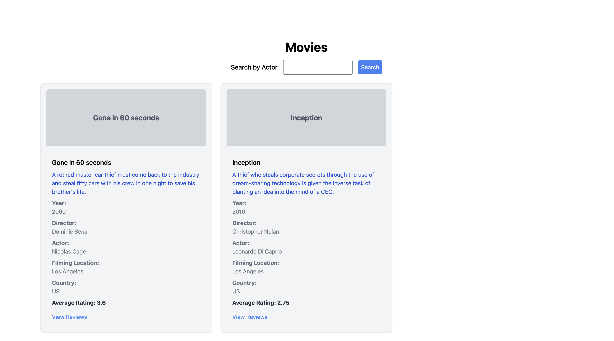
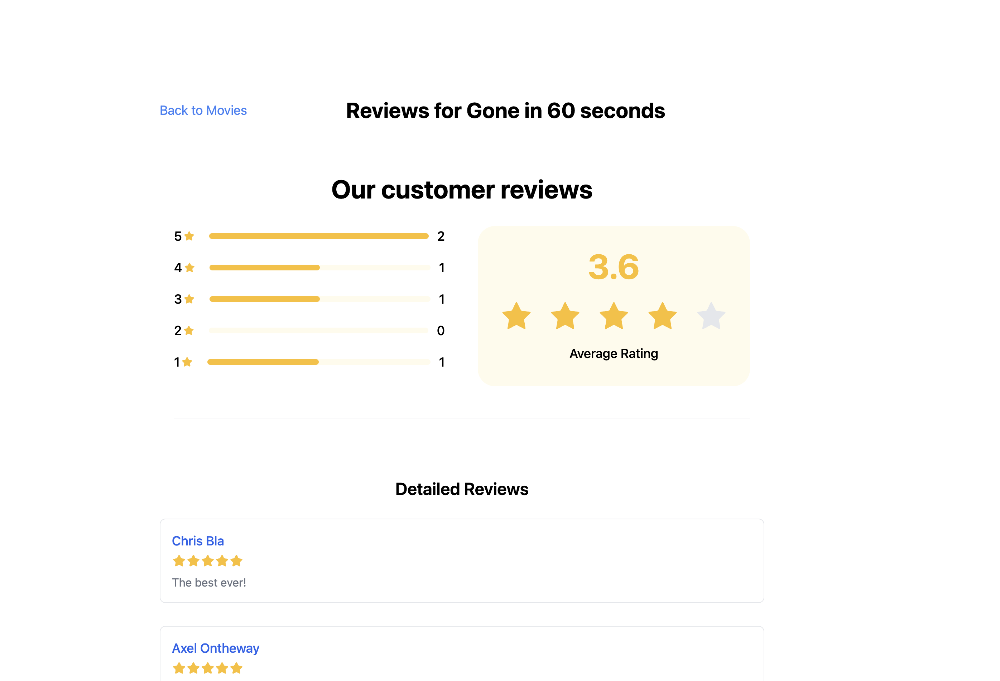

# Active Review
  Active Review is a simple rails app that shows a review of a movie



## Target audience
This application is intended for:

- **Movie Enthusiasts:** Individuals looking to browse and read reviews of various movies.
- **Developers:** Those interested in understanding a basic implementation of a review system in Rails.
- **Learning Enthusiasts:** Students or beginners learning Rails development and database interactions.


# Developer Guide

## Dependencies
- Ruby ruby-3.3.2
- PostgreSQL
- Node


### Setup

To start development, clone the project

```powershell
$ git clone git@github.com:majedbojan/active-reviews.git
$ cd active-reviews
```

Then run

```powershell
bundle install
```
### DB

```powershell
$ rails db:create && rails db:migrate
```

### Seed

```powershell
rake import:movies
```

### Branches

Note: `main` is the primary branch for production-ready code


### Environemtens

- `development`: Development environment
- `test`: Used for unit test
- `production`: End user environment.


### Test cases

```powershell
bundle exec rspec spec/

# Output
Finished in 0.43093 seconds (files took 0.7171 seconds to load)
45 examples, 0 failures, 2 pending
```


## Database Schema

### Movies Table

| Column            | Type    | Constraints           |
|-------------------|---------|------------------------|
| id                | bigint  | not null, primary key  |
| actor             | string  | not null               |
| country           | string  | not null               |
| description       | text    | not null               |
| director          | string  | not null               |
| filming_location  | string  | not null               |
| name              | string  | not null               |
| year              | integer | not null               |
| created_at        | datetime| not null               |
| updated_at        | datetime| not null               |

## Reviews Table

| Column     | Type    | Constraints           |
|------------|---------|------------------------|
| id         | bigint  | not null, primary key  |
| review     | text    | not null               |
| stars      | integer | not null               |
| user       | string  | not null               |
| created_at | datetime| not null               |
| updated_at | datetime| not null               |
| movie_id   | bigint  | not null, foreign key  |

## Relationships

- **Movies** has many **Reviews**.
- **Reviews** belongs to **Movies**.


## Files to review

- [Rake task to import data](https://github.com/majedbojan/active-reviews/blob/main/lib/tasks/one_time_scripts/import_csv.rake)
- [app/models/movie.rb](https://github.com/majedbojan/active-reviews/blob/main/app/models/movie.rb)
- [app/models/review.rb](https://github.com/majedbojan/active-reviews/blob/main/app/models/review.rb)
- [movies_controller.rb](https://github.com/majedbojan/active-reviews/blob/main/app/controllers/movies_controller.rb)
- [reviews_controller.rb](https://github.com/majedbojan/active-reviews/blob/main/app/controllers/reviews_controller.rb)
- [app/controllers/api/v1/movies_controller.rb](https://github.com/majedbojan/active-reviews/blob/main/app/controllers/api/v1/movies_controller.rb)
- [app/controllers/api/v1/reviews_controller.rb](https://github.com/majedbojan/active-reviews/blob/main/app/controllers/api/v1/reviews_controller.rb)
- [controllers/concerns/movie_queryable.rb](https://github.com/majedbojan/active-reviews/blob/main/app/controllers/concerns/movie_queryable.rb)
- [spec/models/movie_spec.rb](https://github.com/majedbojan/active-reviews/blob/main/spec/models/movie_spec.rb)
- [spec/models/review_spec.rb](https://github.com/majedbojan/active-reviews/blob/main/spec/models/review_spec.rb)
- [db/migrate/20240722103014_create_movies.rb](https://github.com/majedbojan/active-reviews/blob/main/db/migrate/20240722103014_create_movies.rb)
- [db/migrate/20240722103015_create_reviews.rb](https://github.com/majedbojan/active-reviews/blob/main/db/migrate/20240722103015_create_reviews.rb)


# API Request Examples


## 1. Get List of Movies
### Fetch a list of all movies:

```powershell
curl -X GET "http://localhost:3000/api/v1/movies"
```
### Filter movies by actor:

```powershell
curl -X GET "http://localhost:3000/api/v1/movies?actor=Example%20Actor"
```
## 2. Get List of Reviews

### Fetch a list of all reviews:
```powershell
curl -X GET "http://localhost:3000/api/v1/reviews"
```

### Get Review Details
```powershell
curl -X GET "http://localhost:3000/api/v1/reviews/REVIEW_ID"
```